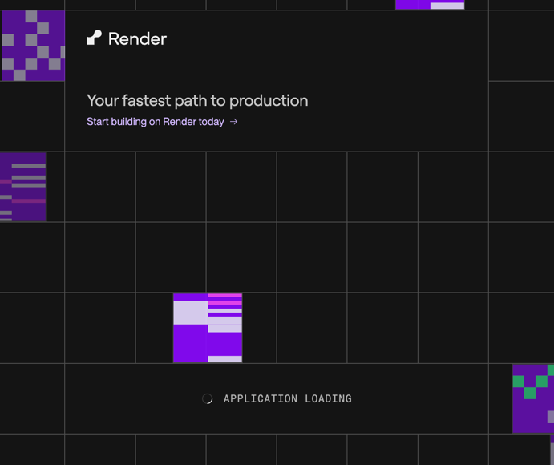

## Запуск проекту
1. Створіть файл .env використовуючи .env.example і заповність його необхідними значеннями
2. Встановіть Docker на ваш пристрій та перевірте, чи він запущений
3. Запустіть проект використовуючи команду наведену нижче
```bash
# development
$ docker compose up
```

## Опис логіки
Проект реалізовано використовуючи NodeJS -> NestJS
Відповідно до наданих вхідних даних було реалізовано роути вказані у ТЗ, автоматичну розсилку email-ів та деплой додатку

### Реалізація підписки
- Реалізовано просте отримання погоди на поточний момент, 1 місто на 1 пошту, використовуючи [api.weatherapi.com](https://api.weatherapi.com) сервіс
- Викликаючи роут api/subscribe, ми генеруємо jwt токен, у який "зашиваємо" базову конфігурацію для підписки.
- Як тільки користувач підтверджує підписку з email-а, ми витягуємо конфігурації підписки з токену і тільки тоді додаємо новий запис у таблицю subscriptions.
- Під час розсилки email-ів ми групуємо всі підписки по 1-му місту, робимо тільки 1 запит на місто і відправляємо результат всім користувачам.
У кожен email додаємо посилання на unsubscribe link, у який знову ж "зашитий" jwt токен з email-ом.

### Можливі покращення при розширенні функціоналу
- Підписки можна відразу додати у таблицю subscriptions, разом із полем confirmed або status (confirmed, created і т.д.).
- Результати виклику погоди варто кешувати, наприклад у Redis, щоби робити менше запитів до умовно платного стороннього сервісу і пришвидшити запит для користувача.
- У додатку є тільки 1 автоматично згенерований тест. Для написання інших тестів необхідне налаштування тестової БД
- Email-и можна покращити відображаючи погоду не на поточний момент, а на наступну годину/наступний день, вирахувати середньодобову температуру і т.д.

### Задеплоєний додаток
Ви можете використати посилання нижче для тесту додатку. Цей домен відповідальний і за форму підписки і за api.
https://weather-forecast-dwtp.onrender.com

Зверність увагу, що можуть виникнути затримки при роботі з сервісом через неактивність безкоштовного інстансу.
Вперше зайшовши на сторінку ви можете зіштовхнутися з таким випадком.


Відповідно до даних з render.com підняття неактивного інстансу може тривати до 50 секунд.